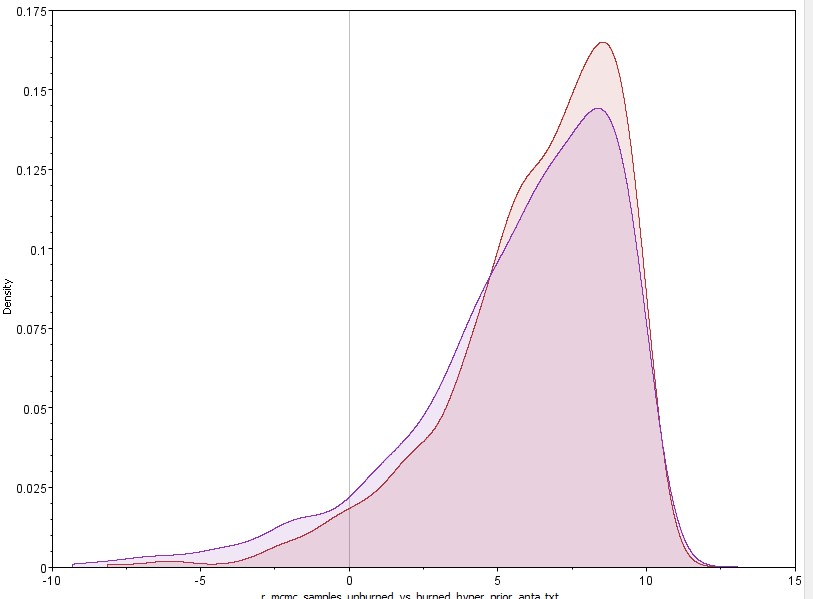
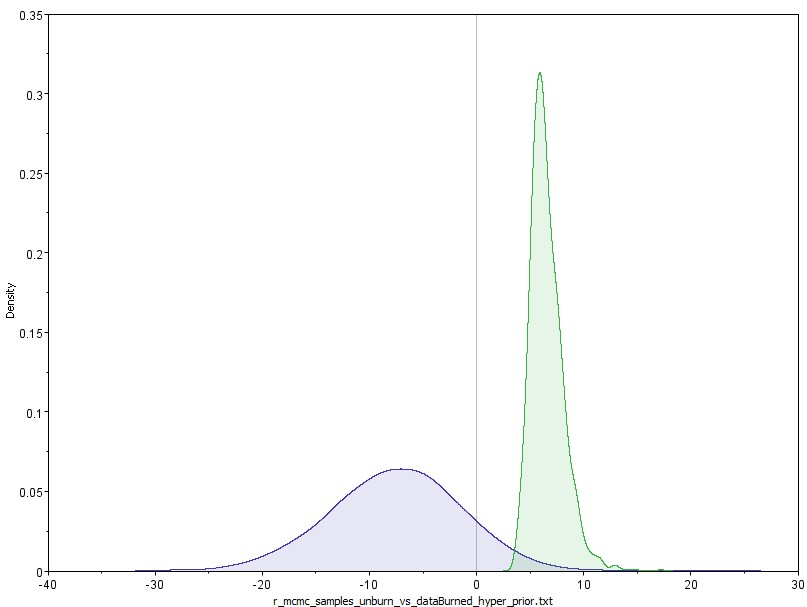
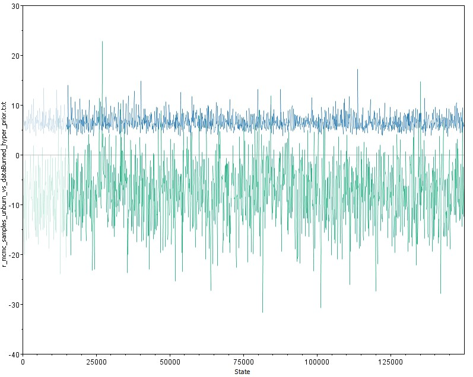

# fire-amazon-vertebrates
Effect of forest fires on Amazonian vertebrates

This GitHub repository contains the files for the paper on the effect of forest fires on Amazon vertebrates by Carvalho Jr et al., *in prep*.





### Description
```src``` This directory contains the main analysis codes.

```data``` Raw and processed camera-trap data from Gurupi Biological Reserve. 

```bin``` A bundle of useful codes needed to fix the raw data or functions that are called by the analysis codes.

```results``` This directory contains results from the analysis such as tables, figures etc. 

# Contact Us
If you have any questions please contact <elildojr@gmail.com>
